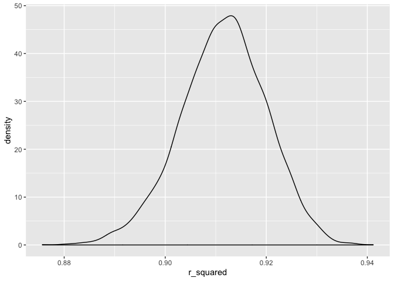
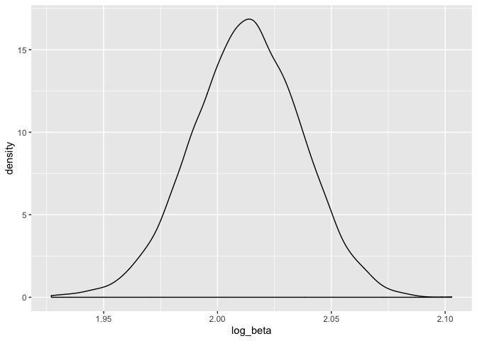

p8105\_Hw6\_Ec3342
================
Ekta Chaudhary
14/11/2019

# Question 1

\#Reading the data set and tidying the data. Converted the numeric to
factor variables. Removed pnumlbw, pnumsga, malform as these variables
had a value of 0 for all the observations.So, there was no point keeping
these variables in the dataset.

``` r
baby_data = read_csv(file = "./data/birthweight.csv") %>%
  janitor::clean_names() %>%
  mutate(
    babysex = as.factor(babysex),
    frace = as.factor(frace),
    malform = as.factor(malform),
    mrace = as.factor(mrace)
  ) %>%
  select(-pnumlbw, -pnumsga, -malform)
```

    ## Parsed with column specification:
    ## cols(
    ##   .default = col_double()
    ## )

    ## See spec(...) for full column specifications.

\#Checking if there are any missing variables. After running the code,
we see that there are no missing variables; Therefore, we do not have to
do anything more to clean the data.

``` r
filter_all(
  baby_data, any_vars(is.na(.))
)
```

    ## # A tibble: 0 x 17
    ## # … with 17 variables: babysex <fct>, bhead <dbl>, blength <dbl>,
    ## #   bwt <dbl>, delwt <dbl>, fincome <dbl>, frace <fct>, gaweeks <dbl>,
    ## #   menarche <dbl>, mheight <dbl>, momage <dbl>, mrace <fct>,
    ## #   parity <dbl>, ppbmi <dbl>, ppwt <dbl>, smoken <dbl>, wtgain <dbl>

\#Propose a regression model for birthweight.

\#As the outcome (baby’s birthweight) is continuous, we can fit a linear
regression model.

\#Baby’s birthweight is associated with Gestational age in weeks. I have
included baby’s sex, mom’s age, mom’s race, mom’s weight gain and
average number of cigarettes smoked per day during pregnancy as these
variables can be associated with baby’s
birthweight.

``` r
model_1 = lm(bwt ~ gaweeks + babysex + momage + mrace  + wtgain + smoken, data = baby_data)
model_1 %>% 
  broom::tidy() 
```

    ## # A tibble: 9 x 5
    ##   term        estimate std.error statistic   p.value
    ##   <chr>          <dbl>     <dbl>     <dbl>     <dbl>
    ## 1 (Intercept)   868.      92.4        9.40 8.99e- 21
    ## 2 gaweeks        54.9      2.14      25.6  7.67e-135
    ## 3 babysex2      -86.0     13.1       -6.55 6.61e- 11
    ## 4 momage          4.82     1.83       2.63 8.51e-  3
    ## 5 mrace2       -276.      15.1      -18.3  5.92e- 72
    ## 6 mrace3       -199.      67.0       -2.97 3.00e-  3
    ## 7 mrace4       -168.      29.6       -5.68 1.42e-  8
    ## 8 wtgain          9.27     0.610     15.2  6.91e- 51
    ## 9 smoken        -11.4      0.916    -12.4  9.80e- 35

\#Show a plot of model residuals against fitted values – use
add\_predictions and add\_residuals in making this plot.

``` r
baby_data %>% 
  modelr::add_predictions(model_1) %>% 
  modelr::add_residuals(model_1) %>% 
  ggplot(aes(x = pred, y = resid)) + geom_point() + 
  labs(x = "Predicted value", 
       y = "Residual")
```

<!-- -->

\#Compare your model to two others:

\#Using cross validation methods to compare my model with two other
models:

``` r
model_2 = lm(bwt ~ blength + gaweeks, data = baby_data) 
#In model 2, using length at birth and gestational age as predictors (main effects only)

model_3 = lm(bwt ~ bhead + babysex + blength + bhead * babysex * blength, data = baby_data) 
#In model 3, using head circumference, length, sex, and all interactions (including the three-way interaction) between these
```

\#Make this comparison in terms of the cross-validated prediction error;
use crossv\_mc and functions in purrr as appropriate.

``` r
set.seed(1)

cv_df =
  crossv_mc(baby_data, 100) %>% 
  mutate(
    train = map(
      train, as_tibble),
         test = map(
           test, as_tibble)
    )
```

``` r
cross_validation = 
  cv_df %>% 
  mutate(
    model_1 = map(
      train, ~ lm(bwt ~ gaweeks + babysex + momage + mrace  + wtgain + smoken, data = .x)
      ),
    model_2 = map(
      train, ~ lm(bwt ~ blength + gaweeks, data = .x)
      ),
    model_3 = map(
      train, ~ lm(bwt ~ bhead + babysex + blength + bhead * babysex * blength, data = .x)
      )
    ) %>% 
  mutate(
    rmse_model_2 = map2_dbl(
      model_2, test, ~ rmse(model = .x, data = .y)
      ),
    rmse_model_3 = map2_dbl(
      model_3, test, ~ rmse(model = .x, data = .y)
      ),
    rmse_model_1 = map2_dbl(
      model_1, test, ~ rmse(model = .x, data = .y)
      )
    )
```

``` r
cross_validation %>% 
  select(
    starts_with("rmse")
    ) %>% 
  pivot_longer(
    everything(),
    names_to = "model",
    values_to = "rmse",
    names_prefix = "rmse_"
  ) %>% 
   mutate(
         model = fct_relevel(model, "model_1","model_2","model_3")
         ) %>% 
  ggplot(aes(x = model, y = rmse, fill = model)) +
  geom_violin() + 
  labs(
    title = "Distribution of Prediction Error Across Models",
    x = "Model",
    y = "RMSE"
  )
```

<!-- -->

\#Based on the violen plots above, we can see that the third model
i.e. the model with three way interaction is the best model because it
has the minimum RMSE.

# Question 2

\#The code chunk below (adapted from the course website) will download
these data.

``` r
weather_df = 
  rnoaa::meteo_pull_monitors(
    c("USW00094728"),
    var = c("PRCP", "TMIN", "TMAX"), 
    date_min = "2017-01-01",
    date_max = "2017-12-31") %>%
  mutate(
    name = recode(id, USW00094728 = "CentralPark_NY"),
    tmin = tmin / 10,
    tmax = tmax / 10) %>%
  select(name, id, everything())
```

    ## Registered S3 method overwritten by 'crul':
    ##   method                 from
    ##   as.character.form_file httr

    ## Registered S3 method overwritten by 'hoardr':
    ##   method           from
    ##   print.cache_info httr

    ## file path:          /Users/ektachaudhary/Library/Caches/rnoaa/ghcnd/USW00094728.dly

    ## file last updated:  2019-10-31 01:11:41

    ## file min/max dates: 1869-01-01 / 2019-10-31

\#The output from the code below shows results from fitting simple
linear regression

``` r
lm(tmax ~ tmin, data = weather_df) %>% 
  broom::tidy() %>% 
  knitr::kable(digits = 3)
```

| term            |   estimate |    std.error |    statistic |  p.value |
| :-------------- | ---------: | -----------: | -----------: | -------: |
| (Intercept)     |      7.209 |        0.226 |       31.847 |        0 |
| tmin            |      1.039 |        0.017 |       61.161 |        0 |
| \#Now writing a | function t | o generate o | ur bootstrap | samples. |

``` r
boot_sample = function(weather_df) {
  sample_frac(weather_df, replace = TRUE)
}
```

\#We should also do a quick check to see if this is working.

``` r
boot_sample(weather_df) %>% 
  ggplot(aes(x = tmin, y = tmax)) + 
  geom_point(alpha = .5) +
  stat_smooth(method = "lm")
```

<!-- -->
\#Doing this for 5000 bootstrap samples

``` r
boot_straps = 
 data_frame(
    strap_number = 1:5000,
    strap_sample = rerun(5000, boot_sample(weather_df))
  )
```

    ## Warning: `data_frame()` is deprecated, use `tibble()`.
    ## This warning is displayed once per session.

\#Analyzing bootstrap samples

``` r
bootstrap_results = 
  boot_straps %>% 
  mutate(
    models = map(strap_sample, ~lm(tmax ~ tmin, data = .x)
                 ),
    results = map(models, broom::glance),
    estimate = map(models, broom::tidy)) %>% 
  select(-strap_sample, -models) %>% 
  unnest() %>%
  select(
    strap_number, r.squared, term, estimate
  ) %>%
  pivot_wider(
    names_from = "term",
    values_from = "estimate"
  ) %>%
  janitor::clean_names() 
```

    ## Warning: `cols` is now required.
    ## Please use `cols = c(results, estimate)`

``` r
bootstrap_results %>% 
  ggplot(aes(x = r_squared)) + 
  geom_density()
```

<!-- -->

\#Using the 5000 bootstrap estimates, identify the 2.5% and 97.5%
quantiles to provide a 95% confidence interval for r̂2

``` r
bootstrap_results %>% 
  pull(r_squared) %>% 
quantile(., probs = c(0.025, 0.975), na.rm = TRUE)
```

    ##      2.5%     97.5% 
    ## 0.8936977 0.9274807

``` r
  bootstrap_results_2 =
  boot_straps %>% 
  mutate(
    models = map(strap_sample, ~lm(tmax ~ tmin, data = .x)
                 ),
    results = map(models, broom::glance),
    estimate = map(models, broom::tidy)) %>% 
  select(-strap_sample, -models) %>% 
  unnest() %>%
  select(
    strap_number, r.squared, term, estimate
  ) %>%
  pivot_wider(
    names_from = "term",
    values_from = "estimate"
  ) %>%
  janitor::clean_names() %>%
  mutate(log_beta = log(intercept*tmin)) 
```

    ## Warning: `cols` is now required.
    ## Please use `cols = c(results, estimate)`

``` r
bootstrap_results_2 %>% 
  ggplot(aes(x = log_beta)) + 
  geom_density()
```

<!-- -->

``` r
bootstrap_results_2 %>% 
  pull(log_beta) %>% 
quantile(., probs = c(0.025, 0.975), na.rm = TRUE)
```

    ##     2.5%    97.5% 
    ## 1.966942 2.058528
